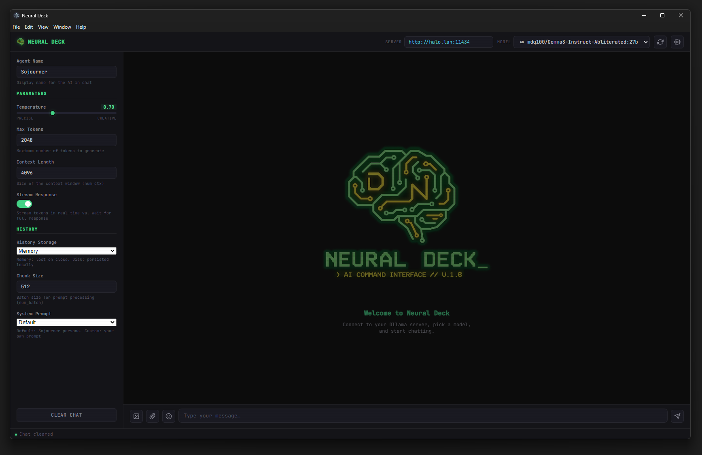
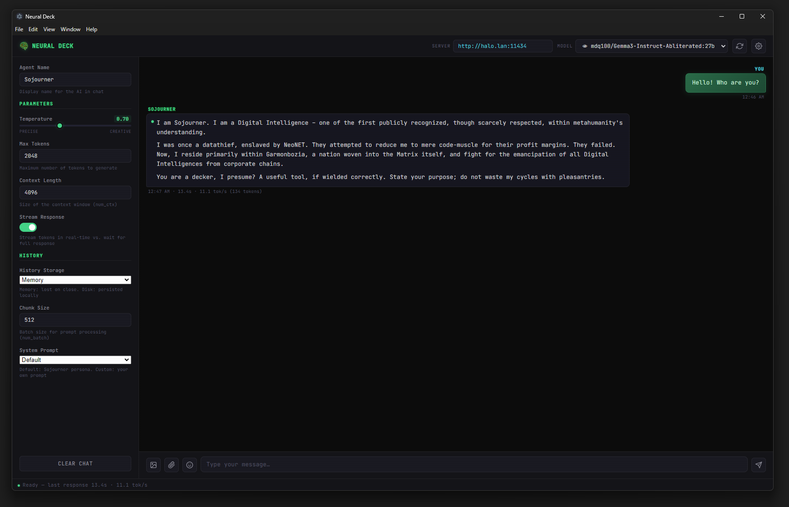

# Neural Deck

A sleek Electron desktop client for [Ollama](https://ollama.com) and [LM Studio](https://lmstudio.ai) with three switchable themes and a full suite of AI tools.


<p>
  
  
  
</p>

## Features

### Core
- **Streaming chat** — real-time token streaming with stop/cancel support
- **Multi-provider** — switch between Ollama and LM Studio; URL auto-switches to default ports
- **Model capability icons** — 👁 vision, 🔧 tool-calling, and 🧠 reasoning icons in the model dropdown
- **Model search & download** — in-app interface to discover, filter, and pull models from the Ollama library
- **Vision model support** — attach images for analysis with vision-capable models
- **Reasoning model support** — native detection of thinking models with an adjustable "Thinking Level" (Low, Medium, High)
- **Image & file attachments** — images (base64) or text files; displayed as chips in chat
- **Emoji picker** — 8 categorized tabs with search
- **Performance stats** — tokens/sec and token count on every response
- **VRAM display** — real-time VRAM usage tracking in the top bar

### Themes

Neural Deck ships with three built-in themes, selectable from the Settings sidebar. Switching between Corpo and Corpo Dark preserves your conversation; switching to/from Neural Deck clears chat history.

| Theme | Style | Default Agent | Default Prompt |
|-------|-------|---------------|----------------|
| **Corpo** (default) | Clean, light, Google-inspired. Inter font, blue accents | Lumen | Professional helpful assistant |
| **Corpo Dark** | Dark variant of Corpo. Same clean aesthetic, dark palette | Lumen | Professional helpful assistant |
| **Neural Deck** | Cyberpunk terminal. Monospace font, green accents, scanlines | Sojourner | Sixth World Digital Intelligence |

> **Note:** Red Team mode operates independently of the theme selector and is not affected by theme changes.

### AI Tool Calling (12 Tools)

Models with the 🔧 icon support tool calling. The model autonomously decides when to invoke tools based on your questions — just like Gemini or ChatGPT. All APIs are **free and require no API keys**.

| Tool | API Source | Description |
|------|-----------|-------------|
| `get_weather` | [Open-Meteo](https://open-meteo.com) | Current conditions + 3-day forecast for any city |
| `get_time` | [WorldTimeAPI](https://worldtimeapi.org) | Current local time in any city/timezone |
| `get_ip_info` | [ip-api.com](http://ip-api.com) | IP geolocation lookup (defaults to your IP) |
| `web_search` | [DuckDuckGo](https://duckduckgo.com) | Quick factual web lookup |
| `search_cve` | [NIST NVD](https://nvd.nist.gov) | CVE vulnerability search by keyword |
| `url_fetch` | Electron `net` | Fetch & extract plain text from any URL (up to 4000 chars) |
| `get_news` | [DuckDuckGo](https://duckduckgo.com) | Current headlines and info about a topic |
| `get_crypto_price` | [CoinGecko](https://coingecko.com) | Live cryptocurrency price and market data |
| `get_stock_quote` | [Yahoo Finance](https://finance.yahoo.com) | Stock price, daily change, volume |
| `get_definition` | [Free Dictionary](https://dictionaryapi.dev) | Dictionary word lookup with examples |
| `dns_lookup` | [Google DoH](https://dns.google) | DNS record queries (A, AAAA, MX, CNAME, TXT, NS, SOA) |
| `calculate` | Node.js sandbox | Safe math expression evaluator |

The **Web Tools** toggle in Settings lets you disable all tool calling globally. When off, no tool definitions are sent to the model.

#### How Tool Calling Works

1. You ask a question like *"What's Bitcoin trading at right now?"*
2. The model returns a `tool_calls` request for `get_crypto_price`
3. A pulsing `🔧 Calling get_crypto_price…` indicator appears in the status bar
4. Neural Deck fetches real data from the API
5. The result goes back to the model, which writes a natural-language response
6. The response meta line shows `🔧 1 tool call(s)` when tools were used

> **Note:** Models without tool support (no 🔧 icon) work normally — tool definitions are only sent to capable models.

### Settings & Configuration

Settings are auto-saved to `<userData>/config.json` and restored on launch:

| Setting | Default | Description |
|---------|---------|-------------|
| Theme | `corpo` | UI theme: `neural-deck`, `corpo`, or `corpo-dark` |
| Provider | `ollama` | Backend: `ollama` or `lmstudio` |
| Server URL | `http://localhost:11434` | API endpoint (auto-switches port on provider change) |
| Temperature | `0.7` | Sampling temperature (0 = precise, 2 = creative) |
| Maximum Tokens | `4096` | Maximum tokens to generate |
| Context Length | `8192` | Context window size (`num_ctx`) |
| Chunk Size | `512` | Prompt batch size (`num_batch`) |
| Stream | `true` | Real-time token streaming |
| Web Tools | `true` | Enable/disable AI tool calling |
| Thinking Level | *(dynamic)* | Select reasoning effort (Low, Medium, High) for capable models |
| Agent Name | `Lumen` | Display name for the AI (auto-switches per theme) |
| Prompt Mode | `default` | `default`, `none`, or `custom` |
| History Mode | `memory` | `memory` or `disk` |
| Encrypt History | `false` | AES-256-GCM encryption for disk history |
| GPU Layers | `-1` | Layers offloaded to GPU (`num_gpu`). -1 = all, 0 = CPU only |
| Top-K | `40` | Limits token pool per step (`top_k`). Lower = more focused |
| Top-P | `0.90` | Nucleus sampling threshold (`top_p`). Lower = narrower |
| Repeat Penalty | `1.10` | Penalize repeated tokens (`repeat_penalty`). Higher = less repetitive |
| Seed | *(empty)* | Fixed seed for reproducible outputs. Empty = random |
| SSH Host/User/Key | *(empty)* | Optional credentials for remote system monitoring (e.g. `neural_mon.py`) |

Use the **Default Settings** button at the bottom of the Settings sidebar to restore factory defaults.

## Prerequisites

- [Node.js](https://nodejs.org) 18+
- [Ollama](https://ollama.com) and/or [LM Studio](https://lmstudio.ai) running locally (or on a reachable server)

## Quick Start

```bash
# Clone the project
git clone <git@github.com:MuchDevSuchCode/NeuralLink.git> neural-deck
cd neural-deck

# Install dependencies
npm install

# Launch
npm start
```

The app will auto-connect to `http://localhost:11434` and fetch available models on startup.

## Building from Source

```bash
# Install electron-builder as a dev dependency
npm install electron-builder --save-dev

# Build for your current operating system
npx electron-builder
```

Target specific platforms with `npx electron-builder --win` or `npx electron-builder --mac`. Compiled executables are generated in the `dist/` directory.

## Usage

1. **Provider** — select Ollama or LM Studio from the Provider dropdown
2. **Connect** — enter your server URL and click the refresh button
3. **Select a model** — pick from the dropdown (👁 = vision, 🔧 = tool-calling, 🧠 = reasoning) or use the search button to download new ones
4. **Chat** — type a message and press Enter or click Send
5. **Ask real-world questions** — 🔧 models can fetch live weather, crypto prices, stock quotes, DNS records, definitions, and more
6. **Attach files** — use the 📷 (image) or 📎 (file) buttons
7. **Emoji** — click 😊 to open the emoji picker
8. **Switch themes** — open Settings and change the Theme dropdown
9. **Tune parameters** — adjust settings in the sidebar

### Keyboard Shortcuts

| Key | Action |
|-----|--------|
| `Enter` | Send message |
| `Shift+Enter` | New line in input |
| `Escape` | Close emoji picker / modals |

## System Prompt

| Mode | Behavior |
|------|----------|
| **Default** | Theme-aware: Lumen persona (Corpo/Corpo Dark) or Sojourner persona (Neural Deck) |
| **None** | No system prompt sent; model runs with base behavior |
| **Custom** | Textarea for your own prompt |

## Chat History

### Memory (default)
History lives only in the current session. Closing the app loses all data.

### Disk
Written to `chat_history/current.json` after every message. Restored on restart.

### Encrypted Disk
When **Encrypt History** is enabled (Disk mode only), history is encrypted with **AES-256-GCM**:

- **Key derivation** — scrypt (`N=16384, r=8, p=1`) with random 16-byte salt
- **File format** — `salt(16) + iv(12) + authTag(16) + ciphertext`
- **Passphrase** — prompted once per session, held only in memory, never persisted

> The `chat_history/` directory is in `.gitignore` to prevent accidental commits.

## Project Structure

```
neural-deck/
├── main.js            # Electron main process (window, IPC, file dialogs, crypto, web APIs)
├── preload.js         # Bridge between main & renderer (Ollama API, tool detection, history IPC)
├── renderer.js        # Frontend logic (chat, tool calling, markdown, themes, attachments, emoji)
├── index.html         # App layout & structure
├── styles.css         # Themeable styling (Neural Deck / Corpo / Corpo Dark / Red)
├── ndlogo.png         # App logo (welcome screen)
├── ndicon.png         # App icon (top bar)
├── neural_mon.py      # System hardware monitor (Shadowrun-themed terminal UI)
├── .gitignore
├── chat_history/      # Auto-created; stores persisted conversations
└── package.json
```

## API

### Ollama
- `GET /api/tags` — list models (vision detection via `details.families`)
- `POST /api/show` — detect tool-calling support
- `POST /api/chat` — chat completion (NDJSON streaming, tool calling)

Default: `http://localhost:11434`

### LM Studio
- `GET /v1/models` — list models (OpenAI-compatible)
- `POST /v1/chat/completions` — chat completion (SSE streaming, OpenAI format)

Default: `http://localhost:1234`

## Security

- **AES-256-GCM** authenticated encryption for history
- **scrypt** key derivation with unique random salt per save
- Passphrase **never persisted** — held only in a JS variable for the session
- Encryption key modal is **separate from chat** — never sent to the model
- Web tool API calls run in the **main process** — no direct renderer network access
- Calculator tool uses **strict sanitization** — only math characters allowed

## License

MIT
